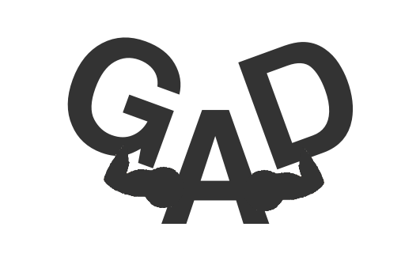

                                          

<strong> GAD </strong> 
GAD, formado por las siglas de Gestor de Actividades Deportivas es una aplicación web desarrollada por el Grupo 31, dentro de la asignatura Aprendizaje Basado en Proyectos, impartida en la Escuela de Ingeniería Informática de la Universidad de Vigo. que se encarga de gestionar todas aquella actividades de carácter deportivo que se desarrollen en centros deportivos de forma genérica y en concreto para dar apoyo a las instalaciones deportivas del Campus de Ourense.
